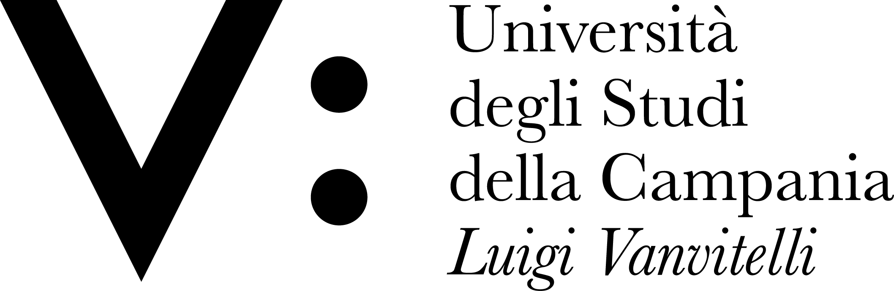

# Corsi di studio / Courses
|IT|EN|
|-|-|
|Fornisce dati in merito ai Corsi di Studio dell'Ateneo|Provides data on the University Courses.|

## Processo / Process
|IT|EN|
|-|-|
|I dati sono acquisiti nell'ambito del monitoraggio degli obiettivi del Piano Strategico di Ateneo|Data is collected as part of monitoring the University Strategic Plan goals|

## Aggiornamento dei dati / Data update
|IT|EN|
|-|-|
|Annuale|Yearly|

## Dataset
**Directory:**  [corsi_di_studio](../data/corsi_di_studio/) 
**Nome file / Filename (json):** [dipartimenti.json](../data/corsi_di_studio/corsi_di_studio.json) 
